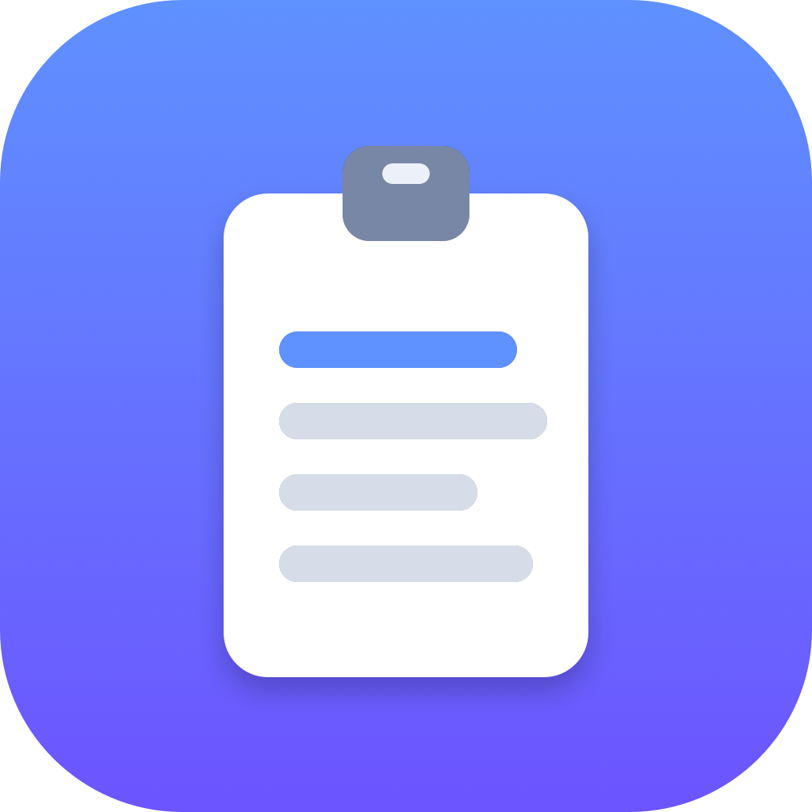

<p align="center">
  
</p>

<h1 align="center">Cliply</h1>

<p align="center">A lightweight, fast native macOS clipboard manager.</p>

Cliply lives in your menu bar, remembers everything you copy (text, images,
files, URLs, colors), and lets you search and reuse it instantly with the
keyboard.

## Status

Early development. Current focus:

- [x] Menu bar app skeleton
- [x] Clipboard history capture (polling)
- [x] Sensitive-content filtering
- [x] Fuzzy search over history
- [x] History popup with keyboard navigation
- [x] Global hotkey (⌘⇧V)
- [ ] Auto-paste into the previous app
- [ ] Pin / favorites
- [ ] iCloud sync

## Requirements

- macOS 14 (Sonoma) or later
- Xcode 16+ / Swift 6

## Build & Run

Quick dev run:

```bash
swift run
```

Build an installable `.app` (with icon) and launch it:

```bash
./Scripts/build_app.sh
open build/Cliply.app          # run
cp -R build/Cliply.app /Applications/   # install
```

The app runs as a menu-bar accessory (no Dock icon). Click the menu bar icon —
or press **⌘⇧V** — to open the history popup. Use ↑/↓ to navigate, **Return**
to copy the selected clip, **Esc** to close.

## Project layout

```
Sources/Cliply/
├── Models/     ClipItem, ClipKind
├── Services/   ClipboardMonitor · Reader · Writer · PrivacyFilter · FuzzySearch · HotkeyService · Store
└── Views/      PopupView · ClipRowView · PopupPanelController
Scripts/        generate_icon.swift · make_icon.sh · build_app.sh
```
